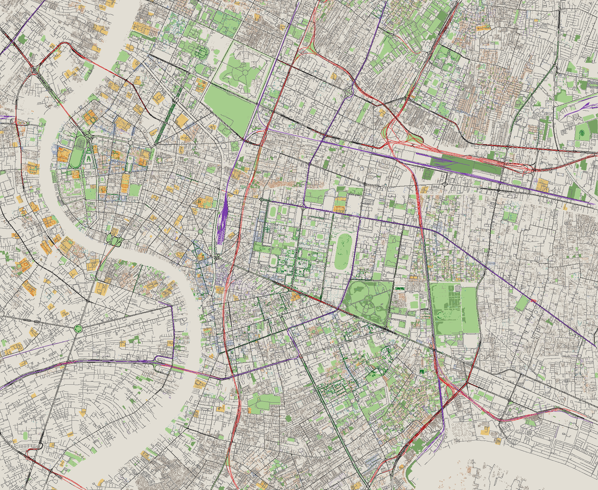

# รายงาน MVP 3 Phase A — ข้อมูลโหมดสมจริง

สร้างด้วย `node scripts/report-real.ts`

## ถนนและราง (roads.bin)
- **25,074 เส้น** (137,773 จุด) จาก way 25,142 เส้น
  — ตัดทิ้ง: ทางเดิน/บันได/ทางจักรยาน/ก่อสร้าง ฯลฯ 11,228, อุโมงค์ใต้ดิน 426
- ตามประเภท: motorway 172, motorway_link 214, trunk 14, trunk_link 3, primary 1178, primary_link 283, secondary 1068, secondary_link 243, tertiary 584, tertiary_link 51, unclassified 317, residential 7463, living_street 6, service 12917, pedestrian 273, busway 36, rail 162, subway 70, monorail 20
- มี `lanes` 2702 เส้น (10.7%), มี `width` 257 (1.0%) ที่เหลือใช้ความกว้างเริ่มต้นตามประเภท
- ยกระดับ: ทางด่วน/รางยกระดับ 359 เส้น, สะพานข้ามแยก 72, สะพานสั้น (ข้ามคลอง) 572
- กติกาความสูง (ค่าประมาณเพื่อแสดงผล): สะพานทางด่วน/รางยกระดับ 14 ม. + 6 ม. ต่อ layer ที่เกิน 1; สะพานอื่นยาว > 120 ม. 7 ม. × layer; สะพานสั้น 1.5 ม.; ลาดที่ปลายที่ต่อกับถนนพื้นราบ (≤ 150 ม.)

## พื้นที่สีเขียวและต้นไม้
- polygon 4,225 รูป: temple 158, grass 3256, pitch 409, cemetery 20, wood 382
- ต้นไม้ (natural=tree) 13,064 ต้น

## ตึก — แท็กสำหรับหน้าตา
- ตึก 92,261 หลัง: มีสีผนัง 48 (0.1%), สีหลังคา 25, รูปหลังคา 91 (0.1%)
  → เกือบทั้งหมดต้องใช้สี/หลังคาแบบ procedural ตามประเภทการใช้งาน
- การใช้งาน: ไม่ระบุ 59,077, บ้าน 18,843, ที่อยู่อาศัยรวม 2,608, พาณิชย์/สำนักงาน 6,865, ศาสนสถาน 1,408, สาธารณะ 2,406, อุตสาหกรรม/โกดัง 195, หลังคา/เพิง 859

## Texture (public/textures, CC0 จาก Poly Haven + waternormals MIT)
- LICENSE.md: 1 KB
- asphalt_diff.jpg: 626 KB
- asphalt_nor.jpg: 129 KB
- grass_diff.jpg: 534 KB
- grass_nor.jpg: 181 KB
- pavement_diff.jpg: 406 KB
- pavement_nor.jpg: 113 KB
- plaster_diff.jpg: 309 KB
- plaster_nor.jpg: 79 KB
- roof_clay_diff.jpg: 363 KB
- roof_clay_nor.jpg: 141 KB
- roof_grey_diff.jpg: 113 KB
- roof_grey_nor.jpg: 97 KB
- waternormals.jpg: 105 KB

## ขนาดไฟล์รวม
- ข้อมูล public/data/study-area: **6.18 MB** (buildings.bin 3.56, buildings.json 0.00, canals.json 0.13, dem.f32 0.42, green.json 0.86, meta.json 0.00, river.json 0.04, roads.bin 1.10, roads.json 0.00, trees.bin 0.05, trees.json 0.00)
- texture: **3.27 MB**
- **รวม 9.45 MB** (เป้า ≤ 15 MB)

ภาพ (1 px = 6 ม.): ดำ = ถนนหลัก, เทา = ถนนรอง/ซอย, **แดง = ทางยกระดับ**, ม่วง = ราง, เขียว = สวน/หญ้า, เขียวเข้ม = ป่า/ต้นไม้, ทอง = ลานวัด,
จุดสีตามการใช้งานตึก (ส้ม = ศาสนสถาน, น้ำเงิน = พาณิชย์, น้ำตาลอ่อน = บ้าน)
