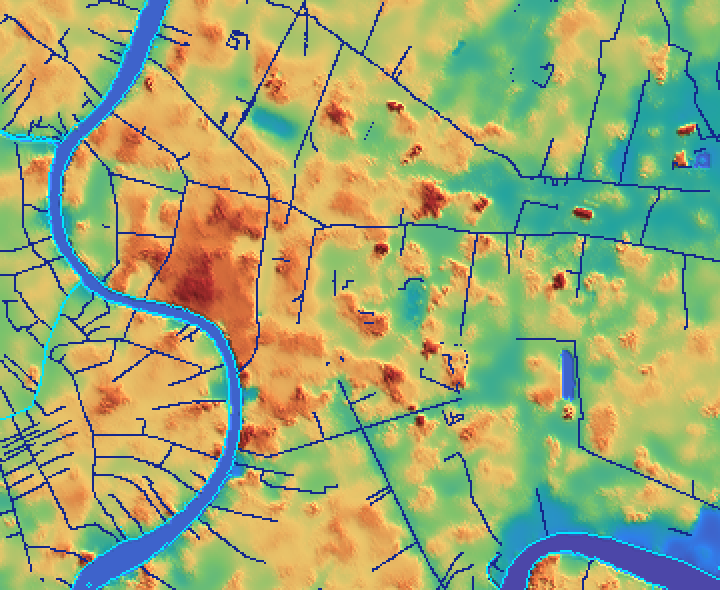

# รายงาน Phase A — ข้อมูลพื้นที่ศึกษา "เกาะรัตนโกสินทร์ – คลองเตย"

สร้างเมื่อ 2026-10-01 18:41 UTC ด้วย `npm run data:report`

## DEM
- แหล่ง: **FABDEM V1-2** — CC BY-NC-SA 4.0 (ห้ามใช้เชิงพาณิชย์)
- กริด 360 × 295 = 106,200 ช่อง ขนาดช่อง ~30.037 × 29.993 ม., bbox lat 13.7–13.78, lon 100.48–100.58
- datum: EGM2008, **verticalOffset = 0 ม. (uncalibrated)** — ตัวเลขทั้งหมดด้านล่างยัง *ไม่ใช่* ม.รทก.
- ผลต่าง Copernicus (DSM) − FABDEM: median 2.34 ม., p95 6.81 ม., max 19.05 ม. (ส่วนที่ FABDEM ตัดตึก/ต้นไม้ออก)

| กลุ่มช่อง | จำนวน | min | p5 | median | p95 | max |
|---|---|---|---|---|---|---|
| ทั้งหมด | 106200 | 0.00 | 1.10 | 3.58 | 5.89 | 18.26 |
| พื้นดิน (ไม่รวมแม่น้ำ/คลอง) | 95833 | 0.00 | 2.16 | 3.64 | 6.02 | 18.26 |
| ในแม่น้ำ (OSM) | 4969 | 0.00 | 0.00 | 0.50 | 2.84 | 7.61 |
| ในคลอง (OSM) | 5398 | 0.00 | 2.21 | 3.52 | 5.03 | 11.16 |

### Histogram ความสูงพื้นดิน (ช่วง 0.5 ม., ซ่อนช่วงที่มี < 5 ช่อง)
```
  0.00–0.50                                                      52
  0.50–1.00   ██                                                 790
  1.00–1.50   █                                                  487
  1.50–2.00   ████                                               1714
  2.00–2.50   █████████████████                                  7262
  2.50–3.00   ████████████████████████████                       11991
  3.00–3.50   ████████████████████████████████████████████       18966
  3.50–4.00   ██████████████████████████████████████████████████ 21443
  4.00–4.50   ███████████████████████████████████                14990
  4.50–5.00   ██████████████████                                 7667
  5.00–5.50   ████████                                           3604
  5.50–6.00   █████                                              2027
  6.00–6.50   ███                                                1398
  6.50–7.00   ███                                                1185
  7.00–7.50   █                                                  636
  7.50–8.00   █                                                  415
  8.00–8.50   █                                                  343
  8.50–9.00   █                                                  226
  9.00–9.50                                                      199
  9.50–10.00                                                     114
 10.00–10.50                                                     89
 10.50–11.00                                                     40
 11.00–11.50                                                     35
 11.50–12.00                                                     43
 12.00–12.50                                                     30
 12.50–13.00                                                     24
 13.00–13.50                                                     15
 13.50–14.00                                                     9
 14.00–14.50                                                     9
 14.50–15.00                                                     8
 15.00–15.50                                                     10
 15.50–16.00                                                     6
```



ภาพ: สีตามความสูง (ม่วง ≤ −0.5 → น้ำเงิน 1 → เขียว 3 → เหลือง 4 → ส้ม 6 → แดง ≥ 10 ม.) ขอบฟ้า = แม่น้ำ OSM, น้ำเงินเข้ม = คลอง OSM

## OSM
- ตึก **92,261 หลัง** (92459 ring, 427,804 จุดหลัง simplify 0.5 ม.)
  - ความสูงจาก `height`: 558 (0.6%) · จาก `building:levels` × 3.2: 16337 (17.7%) · ค่าเริ่มต้นตามประเภท: 75366 (81.7%)
  - ความสูง median 9.00 ม., p95 16.00 ม., max 318.00 ม.
  - สูงสุด 8 หลัง: 318.00 ม. (apartments, จาก height); 314.00 ม. (apartments, จาก height); 275.80 ม. (office, จาก height); 272.20 ม. (apartments, จาก height); 265.60 ม. (apartments, จาก height); 222.00 ม. (apartments, จาก height); 206.00 ม. (apartments, จาก height); 188.00 ม. (apartments, จาก height)
  - ประเภทที่พบมาก: yes 60832, house 18092, commercial 4979, apartments 1462, temple 1272, residential 1110, retail 704, school 624
  - ตัดทิ้ง: เล็กกว่า 4 ตร.ม. 88, อยู่นอก bbox 0, ค่า levels ใช้ไม่ได้ 14
- แม่น้ำ: 8 polygon รวม 4.47 ตร.กม.
  (way/23482543 คลองบางกอกใหญ่ 0.0315; way/40348364 0.0011; way/168554960 0.0552; relation/10888393 0.0546; relation/14038958 1.1213; relation/14038959 1.8824; relation/18828111 0.0017; relation/19388971 1.3229)
- คลอง: 434 เส้น + 61 polygon

## การปรับเทียบ (calibration)
ยังไม่มีจุดอ้างอิงใน `data/calibration.json` (เว้นไว้ให้กรอก — ดูรายการแหล่งข้อมูลที่แนะนำในไฟล์)

## ขนาดไฟล์ (public/data/study-area/)
- buildings.bin: 3024 KB
- buildings.json: 2 KB
- canals.json: 126 KB
- dem.f32: 415 KB
- meta.json: 2 KB
- river.json: 43 KB
- **รวม 3.70 MB** (เป้า ≤ 15 MB)

## จุดที่ข้อมูลดูผิดปกติ
- พื้นดินสูงเกิน 8 ม. (อาจเป็นตึก/สะพาน/ทางด่วนที่ตัดไม่หมด หรือเนินจริง): 98 กลุ่ม, 1216 ช่อง ใหญ่สุด:
  - 451 ช่อง @ 13.7413, 100.5076 (ค่า 8.00–13.91 ม.)
  - 97 ช่อง @ 13.7529, 100.5400 (ค่า 8.01–12.33 ม.)
  - 90 ช่อง @ 13.7505, 100.5114 (ค่า 8.01–10.41 ม.)
  - 49 ช่อง @ 13.7208, 100.5143 (ค่า 8.10–13.66 ม.)
  - 46 ช่อง @ 13.7291, 100.5343 (ค่า 8.03–13.41 ม.)
  - 39 ช่อง @ 13.7645, 100.5268 (ค่า 8.05–10.26 ม.)
  - 31 ช่อง @ 13.7511, 100.5610 (ค่า 8.31–18.26 ม.)
  - 30 ช่อง @ 13.7418, 100.5577 (ค่า 8.08–15.76 ม.)
- ช่องในแม่น้ำ (OSM) ที่ DEM สูงเกิน 2 ม. (สะพาน/ขอบ polygon ไม่ตรง DEM): 160 กลุ่ม, 412 ช่อง
  - 23 ช่อง @ 13.7242, 100.5118 (ค่า 2.01–5.30 ม.)
  - 22 ช่อง @ 13.7372, 100.4882 (ค่า 2.82–3.11 ม.)
  - 22 ช่อง @ 13.7314, 100.4862 (ค่า 2.85–3.12 ม.)
  - 15 ช่อง @ 13.7273, 100.4853 (ค่า 2.97–3.24 ม.)
  - 14 ช่อง @ 13.7397, 100.4987 (ค่า 2.03–3.52 ม.)
- ช่องที่มีค่า 0.00 พอดี 1247 ช่อง (Copernicus/FABDEM ปรับผิวน้ำให้แบน) กลุ่มนอกแม่น้ำ OSM (≥4 ช่อง):
  - ไม่พบ
- spike (ต่างจากค่ากลางรอบข้างเกิน 3 ม.): 106 ช่อง
- **ระดับพื้นโดยรวม:** median พื้นดิน 3.64 ม. (EGM2008) สูงกว่าที่มักอ้างถึงสำหรับกรุงเทพฯ ชั้นใน (~0–2 ม. ม.รทก.)
  อาจมาจาก (ก) ความต่างระหว่าง geoid EGM2008 กับ ม.รทก. (ข) bias ของ DEM ในเขตเมืองหนาแน่น (ค) แผ่นดินทรุดหลังช่วงเก็บข้อมูล TanDEM-X (2011–2015)
  **ยังไม่ได้ปรับ** — ต้องมีจุดอ้างอิงใน `data/calibration.json` ก่อน
- ระดับนี้สำคัญกับการจำลอง: ระดับน้ำเจ้าพระยาในโมเดลอยู่ที่ ~1–2.7 ม.รทก. ขณะที่พื้นดินครึ่งหนึ่งสูงเกิน 3.64 ม. ใน DEM — ถ้า offset จริงเป็นลบมาก ผลการท่วมจะต่างจาก offset = 0 อย่างมาก จึงควรปรับเทียบก่อนตีความผล
